# Queen Leonor App

An interactive **Android app** about the life and legacy of **Queen Leonor** (1458–1525), developed as my **Final Vocational Project (PAP)** for the Technical Course in Computer Science – Systems at **Escola Secundária Rafael Bordalo Pinheiro**. Graded **17/20**.

Home screen

## About the project
Queen Leonor was a queen of Portugal and the founder of the Caldas da Rainha thermal hospital. The theme was suggested by my teacher, in the context of the commemoration of the 500th anniversary of her death. The app presents her history in an interactive way, with support for **Portuguese and English**, and it was the project where I learned to build an Android app from scratch.

## Features
- **Biography:** the life and story of Queen Leonor
- **Interactive timeline:** the key moments of her life
- **Interactive map:** explore Google Maps inside the app, with the important places in Portugal where the Queen passed through
- **Quiz:** questions and answers with a varied set of questions, so the quiz is never the same
- **Image gallery:** important images about the Queen, connected to the map
- **Language switch:** available in Portuguese and English

## Screenshots

| Home | Biography | Timeline | Gallery |
|:----:|:---------:|:--------:|:-------:|
| 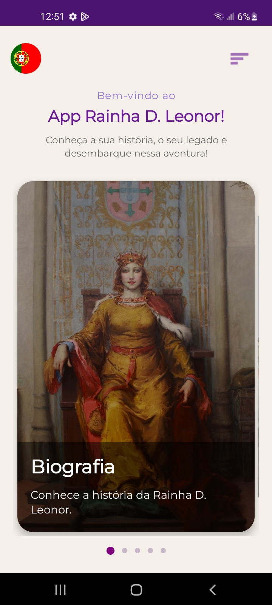 | 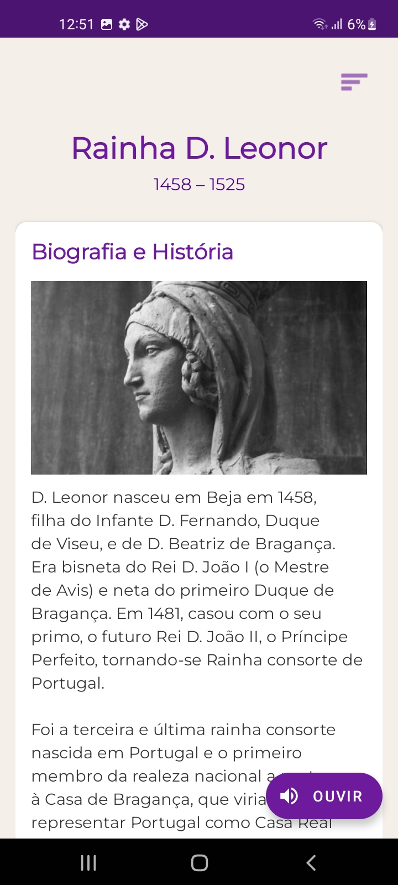 | 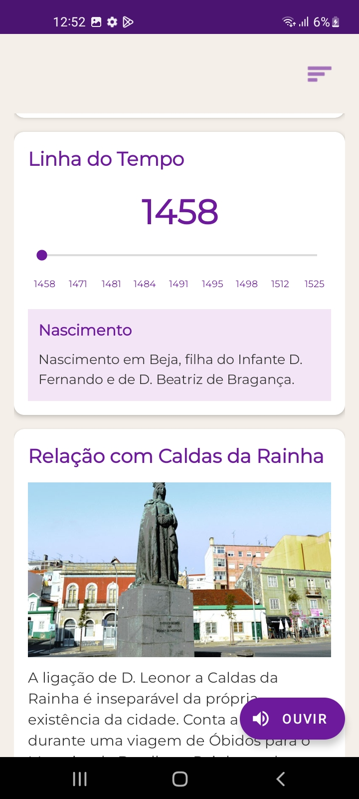 | 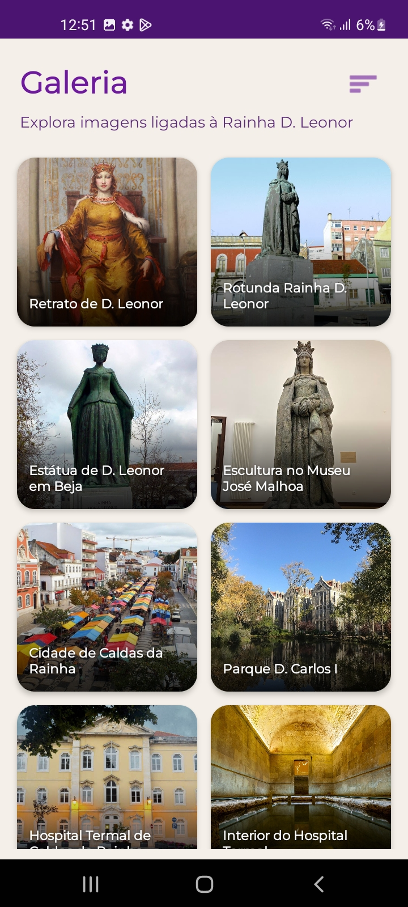 |

| Gallery (full view) | Map of places | Map with route | Place details |
|:-------------------:|:-------------:|:--------------:|:-------------:|
| 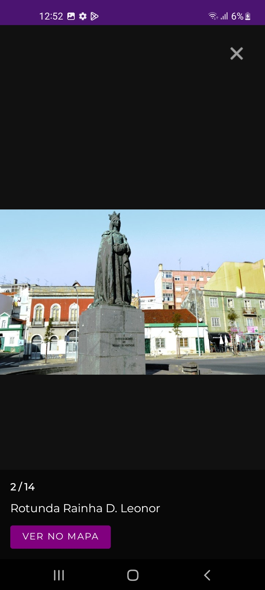 | 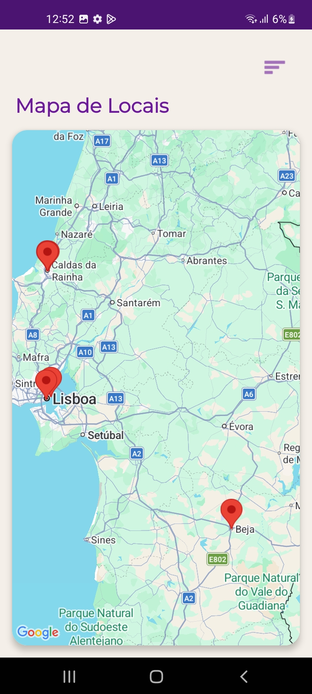 | 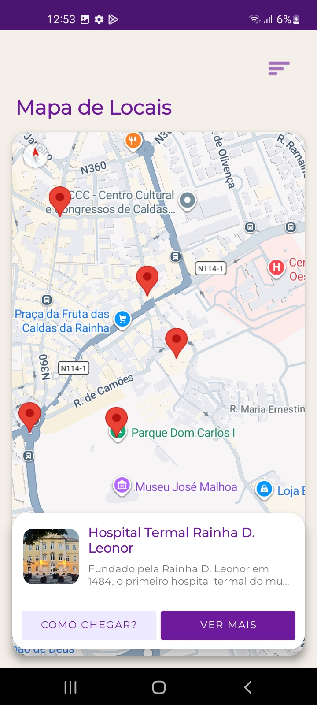 | 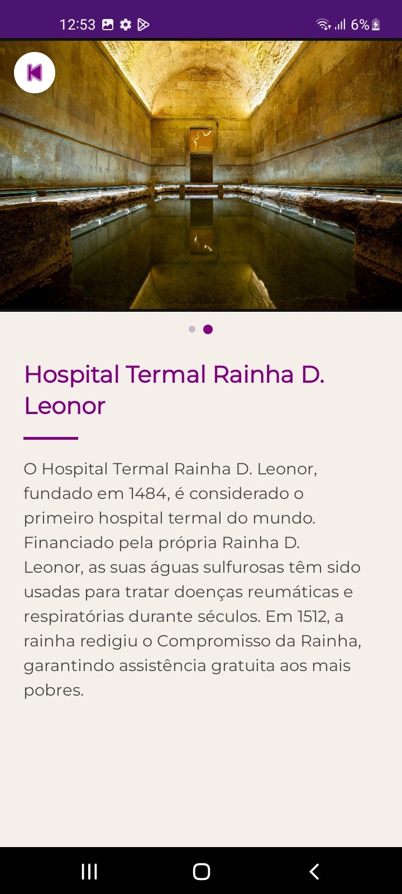 |

| Curiosities | Quiz | Quiz answer | Quiz result |
|:-----------:|:----:|:-----------:|:-----------:|
| 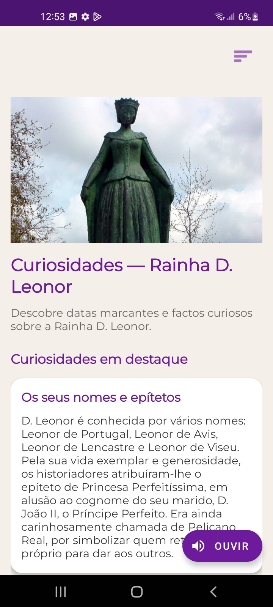 | 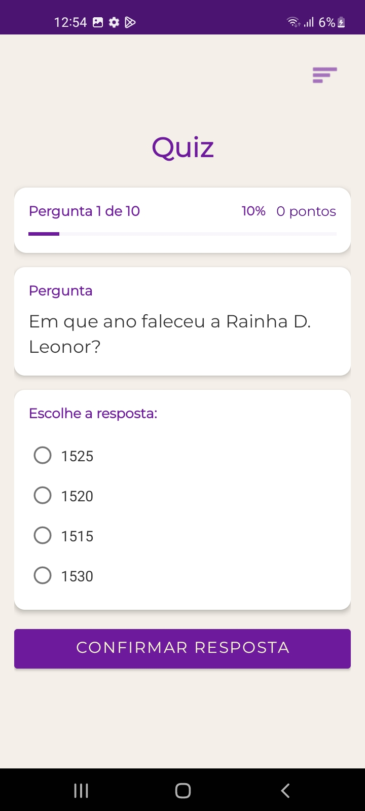 | 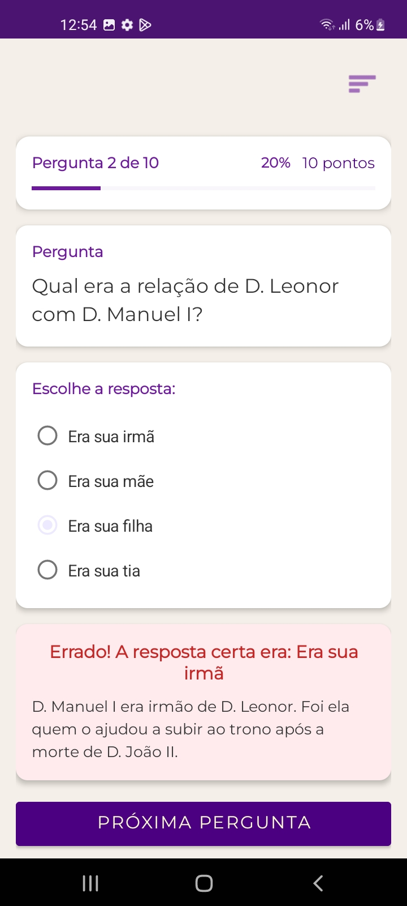 | 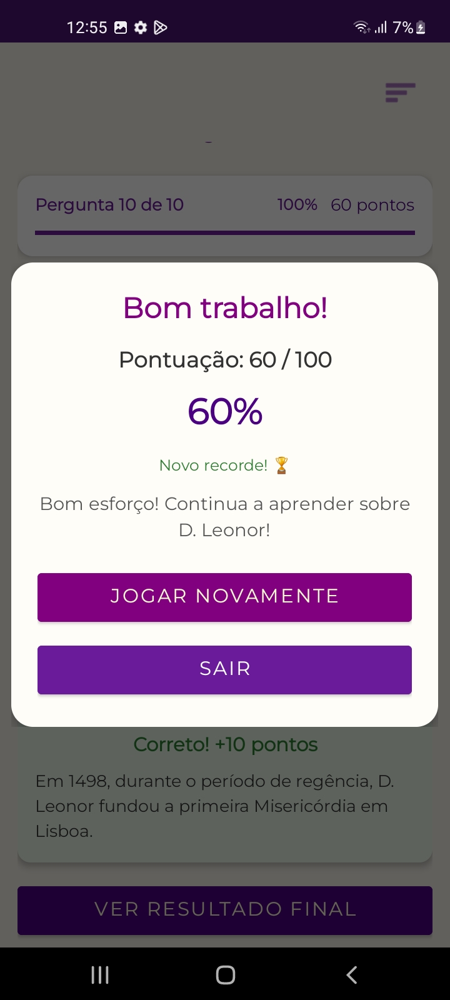 |

| Menu | Language selection |
|:----:|:------------------:|
| 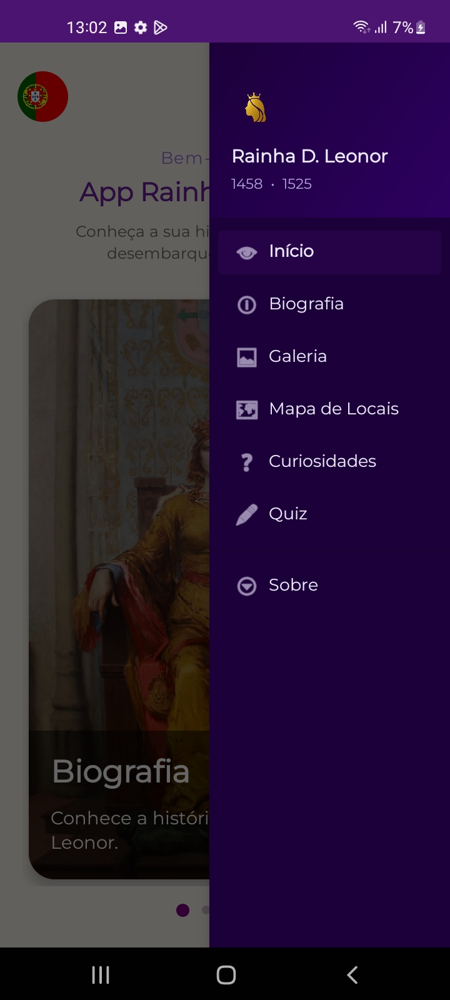 | 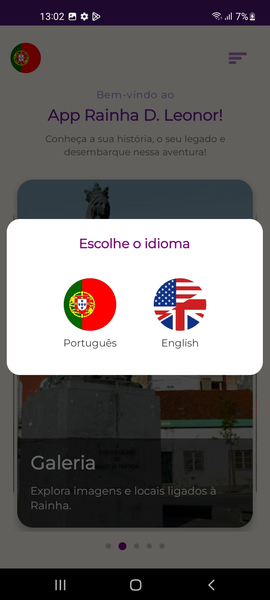 |

## Built with
- **Kotlin**
- **XML** (user interface layouts)
- **Android Studio**
- **Google Maps** integration
- Multi-language support (string resources for PT/EN)

The app stores its content internally and does not use a database.

## What I learned
- How to create an Android app from scratch with Kotlin and Android Studio
- How to design screens and layouts using XML
- How to integrate Google Maps into an app
- How to implement multi-language support
- How to plan, develop and present a complete project

## Context
- **School:** Escola Secundária Rafael Bordalo Pinheiro, Caldas da Rainha
- **Course:** Technical Course in Computer Science – Systems (2023–2026)
- **Project type:** Professional Aptitude Test (PAP)
- **Year:** 2026
- **Grade:** 17/20

## Author
**Pedro Parochi**, Computer Engineering student at the University of Leiria and Oeste (ULO)
LinkedIn · pedroparochi20@gmail.com
